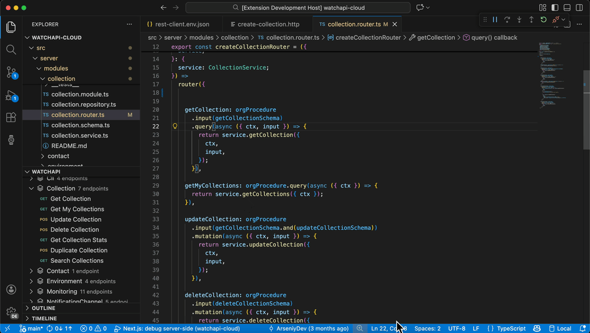

# WatchAPI - Code-Synced API Client

[](https://opensource.org/licenses/MIT)
[](https://github.com/watchapi/watchapi/actions/workflows/ci.yml)
[](https://open-vsx.org/extension/watchapi/watchapi-client)


<a href="https://discord.gg/5bANxHbfNx">

</a>

> **Make code as source of truth** for your API tests, sync endpoints directly from Next.js, NestJS, and tRPC.



## Why WatchAPI Exists

- No need to manually write endpoints or reverse-engineer your APIs
- Reduces API drifts and context switching
- Closes the gap between actual code and tool for testing

## How WatchAPI Works

- Extracts API schemas as ready to use tests
- Removes the need to write tests manually
- Organizing APIs directly in the code editor

## Supported Environments

- **Next.js (App router), NestJS, tRPC and PayloadCMS** - main focus
- **Next.js (Pages router)** - less accurate


## Quick Start

### Installation

1. Install the extension: [Marketplace](https://marketplace.visualstudio.com/items?itemName=WatchAPI.watchapi-client) or [Open VSX](https://open-vsx.org/extension/watchapi/watchapi-client)
2. Click the 'watch' icon in the activity bar
3. **Pull from Code:** Auto-detect all Next.js/NestJS/tRPC endpoints (recommended)
4. **Or create manually:** Click '+ New Collection' to add endpoints by hand
5. Navigate and open requests to execute: 'Send Request'

---

Works locally by default. Sign in optional (enables team features).

## HTTP File Syntax

WatchAPI uses `.http` files compatible with REST Client. Full syntax reference:

### Basic Request

```http
GET https://api.example.com/users
Authorization: Bearer {{token}}
```

### Request with Body

```http
POST https://api.example.com/users
Content-Type: application/json

{
  "name": "John",
  "email": "john@example.com"
}
```

### File Variables

Define variables at the top of your `.http` file:

```http
@baseUrl = https://api.example.com
@token = my-secret-token

GET {{baseUrl}}/users
Authorization: Bearer {{token}}
```

### Environment Variables

Create `rest-client.env.json` in your workspace:

```json
{
    "local": {
        "baseUrl": "http://localhost:3000",
        "token": "dev-token"
    },
    "production": {
        "baseUrl": "https://api.example.com",
        "token": "prod-token"
    }
}
```

Use variables with `{{variableName}}` syntax.

### System Variables

| Variable                 | Description              | Example                   |
| ------------------------ | ------------------------ | ------------------------- |
| `{{$timestamp}}`         | Unix timestamp (seconds) | `1737550800`              |
| `{{$guid}}`              | Random UUID v4           | `f47ac10b-58cc...`        |
| `{{$randomInt min max}}` | Random integer           | `{{$randomInt 1 100}}`    |
| `{{$processEnv VAR}}`    | Environment variable     | `{{$processEnv API_KEY}}` |

## Comparison

| Feature                    | WatchAPI | Postman | Thunder Client | REST Client |
| -------------------------- | -------- | ------- | -------------- | ----------- |
| Auto-Import Next.js/NestJS | ✓        | ✗       | ✗              | ✗           |
| Native VS Code Extension   | ✓        | ✗       | ✓              | ✓           |
| Team Collaboration         | ✓        | ✓       | Paid / Limited | ✗           |
| Production Monitoring      | ✓        | ✓       | ✗              | ✗           |
| Free Tier                  | ✓        | Limited | ✓              | ✓           |
| Works Offline              | ✓        | Limited | ✓              | ✓           |

## Privacy & Data

**Local-First & Open Source:**

- All collections stored on your machine by default
- No telemetry or usage tracking
- **Open source** under MIT license
- Optional cloud sync (only when signed in)

Privacy Policy: [https://watchapi.dev/privacy](https://watchapi.dev/privacy)

## Contributing

Welcome, lets collaborate:

- **Read the [Contributing Guide](CONTRIBUTING.md)** to get started
- **Report bugs** via [GitHub Issues](https://github.com/watchapi/watchapi/issues)
- **Request features** via [GitHub Discussions](https://github.com/watchapi/watchapi/discussions)
- **Submit PRs** - we review and merge regularly
- **Review the [Code of Conduct](CODE_OF_CONDUCT.md)** before contributing

See [SECURITY.md](SECURITY.md) for reporting security vulnerabilities.

## Support

- **Report Issues:** [GitHub Issues](https://github.com/watchapi/watchapi/issues)
- **Discussions:** [GitHub Discussions](https://github.com/watchapi/watchapi/discussions)
- **Documentation:** [docs.watchapi.dev](https://docs.watchapi.dev)
- **Website:** [watchapi.dev](https://watchapi.dev)

## License

This project is under the [MIT License](LICENSE).

---

**Let your code define the testing workflow**
