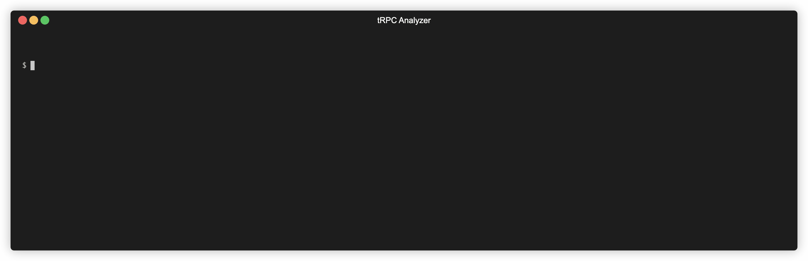

# API Monitoring & tRPC Analyzer CLI

[](https://github.com/yourusername/api-monitoring/blob/main/LICENSE)
[](https://www.typescriptlang.org/)
[]()
[](https://www.npmjs.com/package/@watchapi/cli)
[](https://www.npmjs.com/package/@watchapi/cli)

CLI tool for API monitoring and regression detection in CI/CD pipelines.


## Installation

```bash
npm install -g @watchapi/cli
# or
npx @watchapi/cli
```

## Quick Start

### 1. Log in once (recommended)

```bash
watchapi login --api-token your-api-token --api-url https://your-platform.com
```

This stores credentials in `~/.watchapi/config.json` for reuse.

### 3. Run checks in your CI/CD pipeline

```bash
watchapi check --collection <collection-id> --env production
```

## Usage

### Login Command

Store credentials locally so you can skip passing tokens on every run.

```bash
watchapi login --api-token <token> [--api-url <url>]
```

### Logout Command

Remove locally saved credentials.

```bash
watchapi logout
```

### Check Command

Run API checks for a collection and detect regressions.

```bash
watchapi check [options]
```

**Options:**

- `-c, --collection <id>` - **(Required)** Collection ID to check
- `-e, --env <environment>` - Environment name (default: "production")
- `--api-url <url>` - Platform API URL (default: flag → `WATCHAPI_URL` → saved login → production URL)
- `--api-token <token>` - API authentication token (default: flag → `WATCHAPI_TOKEN` → saved login)
- `--fail-on <mode>` - When to fail the CI/CD pipeline:
  - `regressions` (default) - Fail only if regressions detected
  - `any` - Fail if any check fails

**Examples:**

```bash
# Basic usage
watchapi check --collection abc123

# Specify environment
watchapi check --collection abc123 --env staging

# Fail on any failure (not just regressions)
watchapi check --collection abc123 --fail-on any

# Use custom API URL
watchapi check --collection abc123 --api-url https://api.example.com
```

### Sync Command

Discover APIs from your codebase (Next.js tRPC for now) and sync them to the platform. Endpoints are matched by `method + URL`, updated when they already exist, and stale ones are left untouched.

```bash
watchapi sync --root . --tsconfig tsconfig.json --domain https://api.example.com --prefix api/trpc
```

For Nest projects (OpenAPI 3.x), point to your schema file and switch targets (auto-detected when omitted):

```bash
watchapi sync --target nest --include openapi.yaml --prefix api
```

If you use the default Nest Swagger setup, omitting `--include` will try `api-json` first. You can also pass an exported spec file or a URL, which lets you sync without running the Nest app locally (e.g., `watchapi sync --target nest --include docs/openapi.json` or `--include https://example.com/api-json`).

**Options:**

- `-t, --target <target>` - Adapter target (auto-detected when omitted; options: `next-trpc` | `nest`)
- `--root <path>` - Project root to scan (default: cwd)
- `--tsconfig <path>` - Path to tsconfig (default: `tsconfig.json`)
- `--include <globs...>` - Override glob(s) for router files or OpenAPI file/URL
- `--domain <url>` - Optional Base domain to prepend to synced endpoint paths
- `--prefix <path>` - Optional path prefix before the router/procedure (e.g., `api/trpc`)
- `--api-url <url>` / `--api-token <token>` - Override platform connection
- `--dry-run` - Print detected APIs without syncing
- `--router-factory` / `--router-identifier-pattern` - Customize tRPC detection

If you omit `--target`, the CLI inspects `package.json` in your project root to decide:

- Next.js + tRPC deps → `next-trpc`
- NestJS + `@nestjs/swagger` deps → `nest`
- Ambiguous/unknown → prompts you to pass `--target`

## CI/CD Integration

### GitHub Actions

```yaml
name: Deploy

on:
  push:
    branches: [main]

jobs:
  deploy:
    runs-on: ubuntu-latest
    steps:
      - uses: actions/checkout@v4

      # Your deployment steps here
      - name: Deploy to production
        run: ./deploy.sh

      # Run API health checks
      - name: API Health Check
        run: npx @watchapi/cli check --collection ${{ secrets.COLLECTION_ID }} --env production
        env:
          WATCHAPI_TOKEN: ${{ secrets.WATCHAPI_TOKEN }}
```

### GitLab CI

```yaml
deploy:
  stage: deploy
  script:
    - ./deploy.sh
    - npx @watchapi/cli check --collection $COLLECTION_ID --env production
  variables:
    WATCHAPI_TOKEN: $WATCHAPI_TOKEN
```

### CircleCI

```yaml
version: 2.1

jobs:
  deploy:
    docker:
      - image: node:20
    steps:
      - checkout
      - run: ./deploy.sh
      - run:
          name: API Health Check
          command: npx @watchapi/cli check --collection $COLLECTION_ID --env production
          environment:
            WATCHAPI_TOKEN: $WATCHAPI_TOKEN
```

### Jenkins

```groovy
pipeline {
  agent any

  environment {
    WATCHAPI_TOKEN = credentials('watchapi-token')
  }

  stages {
    stage('Deploy') {
      steps {
        sh './deploy.sh'
      }
    }

    stage('Health Check') {
      steps {
        sh 'npx @watchapi/cli check --collection ${COLLECTION_ID} --env production'
      }
    }
  }
}
```

## How It Works

1. **Fetch Collection**: CLI fetches your collection definition from the platform (endpoints, expected responses, etc.)
2. **Run Checks**: Executes HTTP requests to all endpoints in your environment
3. **Analyze Results**: Compares results with historical data to detect:
   - Status code changes (passing → failing)
   - Performance regressions (2x slower than average)
   - Response body changes
4. **Report**: Sends results back to platform for tracking
5. **Exit**: Returns appropriate exit code for CI/CD (0 = pass, 1 = fail)

## Regression Detection

The CLI automatically detects regressions by comparing current results with historical data:

### Status Regressions

- Endpoint was passing in last 3 checks → now failing
- Example: API returned 200 OK, now returns 500 Error

### Performance Regressions

- Response time is 2x slower than 5-check average
- Example: Average 100ms → now 250ms

### When using `--fail-on regressions`

- [✓] New endpoint fails: Won't block deployment (no baseline)
- [✓] Endpoint consistently failing: Won't block (not a regression)
- [✗] Previously passing endpoint fails: **Blocks deployment**
- [✗] Performance degradation (2x slower): **Blocks deployment**

### When using `--fail-on any`

- [✗] Any failure or error: **Blocks deployment**

## Output Example

```
============================================================
  API Check Results - production
============================================================

Summary:
  Total:  5
  ✓ Passed: 4
  ✗ Failed: 1
  ⚠ Errors: 0

⚠ REGRESSIONS DETECTED:
  • Endpoint api-endpoint-123: was passing in last 3 checks, now FAILED

Details:
✓ Endpoint api-endpoint-123
  Status: 200 | Response Time: 145ms

✗ Endpoint api-endpoint-456
  Failed assertions:
    • Status code: expected different, got 500
    • Response time: 2500ms (too slow)

============================================================
```

## Authentication

Get your API token from the platform:

1. Log in to your account
2. Go to Settings → API Tokens
3. Create a new token for CI/CD
4. Store it securely in your CI/CD secrets

## Troubleshooting

### "API token is required"

- Set `WATCHAPI_TOKEN` environment variable
- Or use `--api-token` flag

### "Collection not found"

- Verify collection ID is correct
- Ensure your API token has access to the collection

### Checks timing out

- Increase timeout in endpoint configuration on the platform
- Check network connectivity from CI/CD to your APIs

## Analyzer-Only Quick Start



Need just the static analyzer? It works standalone:

```bash
# Scan your project (table view)
npx @watchapi/cli analyze --root . --tsconfig tsconfig.json --include "src/server/**/*.ts"

# JSON output for CI/pipelines
npx @watchapi/cli analyze --format json > trpc-analyzer-report.json

# Scan Next.js App Router route handlers
npx @watchapi/cli analyze --target next-app-router --include "app/api/**/route.{ts,tsx}"

# Analyze a Nest OpenAPI 3.x spec
npx @watchapi/cli analyze --target nest --include openapi.yaml
```

Programmatic API:

```ts
import {
  detectTargets,
  getNextAppRoutes,
  getNextTrpcProcedures,
  getNestOperations,
} from "@watchapi/cli";

// Detect frameworks present in a repo
const detected = await detectTargets();

// Get typed route/procedure lists without the CLI
const appRoutes = await getNextAppRoutes({ rootDir: "/path/to/app" });
const trpcProcedures = await getNextTrpcProcedures({ rootDir: "/path/to/app" });
const nestOperations = await getNestOperations({ include: ["openapi.yaml"] });
```

**What `analyze` shows you (so you can spot issues early):**
- Every detected API (method + path/procedure) for a quick surface audit.
- Missing `operationId` values in OpenAPI specs to keep endpoint identity stable.
- OpenAPI summaries, descriptions, and tags to validate documentation coverage.
- tRPC metadata like visibility, resolver size, DB usage, error handling, and side effects to flag risky handlers.
- Next.js App Router handler metadata: method/path derivation, handler length, DB usage, error handling, side effects, and response-shape hints.
- tRPC quality signals: missing input schemas, implicit outputs, naming mismatches, DB calls without error handling, heavy resolvers, side-effectful queries, public sensitive mutations that should have auth/rate limiting, and oversized/singular routers.
- File/line references for fast jump-to-definition in your editor.

**Key flags:**

- `--root` (default: cwd) project root to scan
- `--tsconfig` path to the tsconfig used by your tRPC project
- `--include` glob(s) to target router/procedure files
- `--format table|json` choose console table or machine-readable JSON
- `--router-factory` / `--router-identifier-pattern` override router detection if you use custom helpers
- `--target next-trpc|next-app-router|nest` force a specific analyzer target (auto-detected when possible)

## Contributing

See `CONTRIBUTING.md` for a minimal setup and workflow guide.

## Support

- Documentation: https://watchapi.dev/docs
- Issues: https://github.com/watchapi/watchapi-cli/issues
- Email: support@watchapi.dev
- Discord: https://discord.gg/5bANxHbfNx
