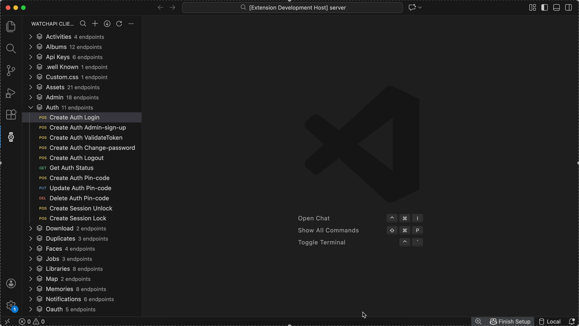

# WatchAPI - REST Client & API Testing

> WatchAPI is REST & tRPC Client for modern backends

---

## Why This Exists

-   Makes code as source of truth for API tests
-   Reduces API drifts and context switching
-   Closes the gap between actual code and tool for testing

---

## What It Does

-   Extracts API schemas as ready to use tests
-   Removes the need to write tests manually
-   Organizing APIs directly in the code editor

---

## Supported Environments

-   **Next.js (App router), NestJS and tRPC** - main focus
-   **Next.js (Pages router)** - less accurate
-   **Express, Fastify and Hono** - planned

---

## Quick Start

### Installation

1. Install the extension: [Marketplace](https://marketplace.visualstudio.com/items?itemName=WatchAPI.watchapi-client) or [Open VSX](https://open-vsx.org/extension/watchapi/watchapi-client)
2. Click the 'watch' icon in the activity bar
3. **Pull from Code:** Auto-detect all Next.js/NestJS/tRPC endpoints (recommended)
4. **Or create manually:** Click '+ New Collection' to add endpoints by hand
5. Navigate and open requests to execute: 'Send Request'

---

Works locally by default. Sign in optional (enables team features).

## Comparison

| Feature                    | WatchAPI | Postman | Thunder Client | REST Client |
| -------------------------- | -------- | ------- | -------------- | ----------- |
| Auto-Import Next.js/NestJS | ✓        | ✗       | ✗              | ✗           |
| Native VS Code Extension   | ✓        | ✗       | ✓              | ✓           |
| Team Collaboration         | ✓        | ✓       | Paid / Limited | ✗           |
| Production Monitoring      | ✓        | ✓       | ✗              | ✗           |
| Free Tier                  | ✓        | Limited | ✓              | ✓           |
| Works Offline              | ✓        | Limited | ✓              | ✓           |

## Privacy & Data

**Local-First & Open Source:**

-   All collections stored on your machine by default
-   No telemetry or usage tracking
-   Optional cloud sync (only when signed in)
-   **Open source** under MIT license

Privacy Policy: [https://watchapi.dev/privacy](https://watchapi.dev/privacy)

## Contributing

Welcome, lets collaborate:

-   **Read the [Contributing Guide](CONTRIBUTING.md)** to get started
-   **Report bugs** via [GitHub Issues](https://github.com/watchapi/watchapi/issues)
-   **Request features** via [GitHub Discussions](https://github.com/watchapi/watchapi/discussions)
-   **Submit PRs** - we review and merge regularly
-   **Review the [Code of Conduct](CODE_OF_CONDUCT.md)** before contributing

See [SECURITY.md](SECURITY.md) for reporting security vulnerabilities.

## Support

-   **Report Issues:** [GitHub Issues](https://github.com/watchapi/watchapi/issues)
-   **Discussions:** [GitHub Discussions](https://github.com/watchapi/watchapi/discussions)
-   **Documentation:** [docs.watchapi.dev](https://docs.watchapi.dev)
-   **Website:** [watchapi.dev](https://watchapi.dev)

## License

This project is under the [MIT License](LICENSE).

---

**Let your code define the testing workflow**
